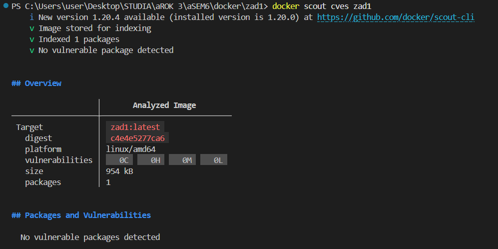
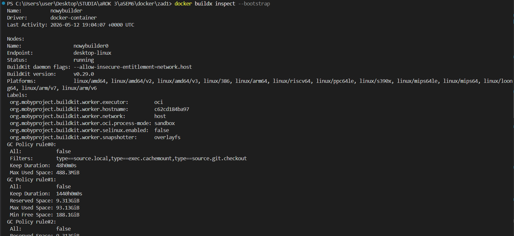
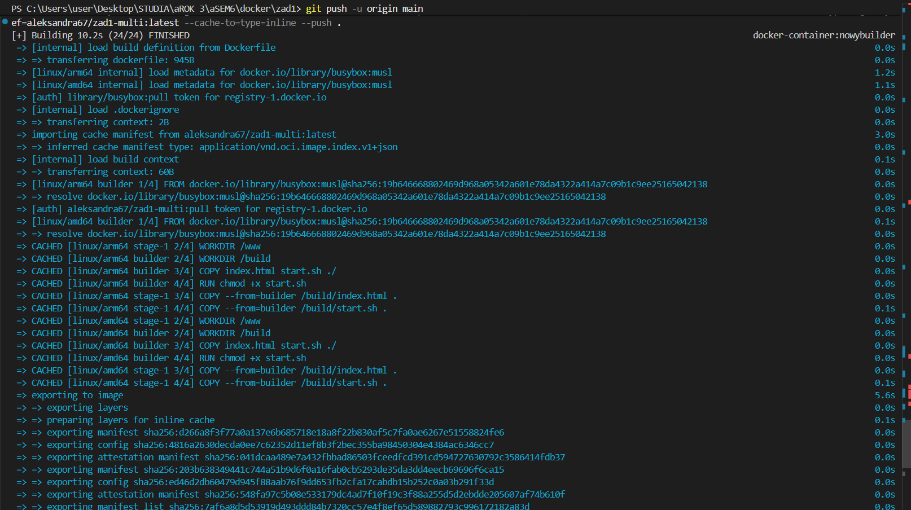
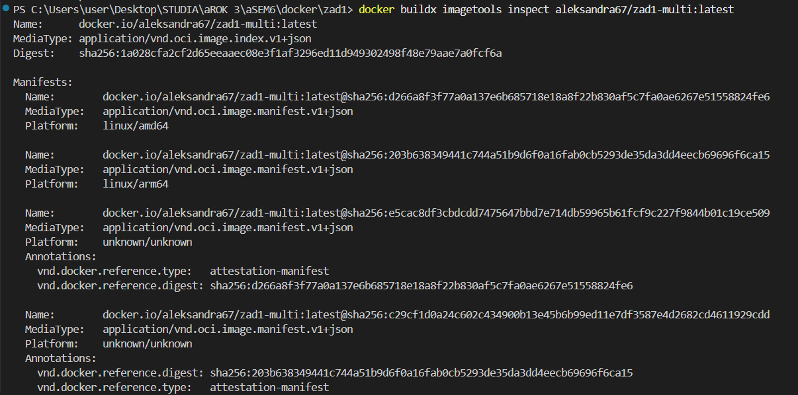

Część nieobowiązkowa opcja 2
Aleksandra Grzywacz 101570

1. Sprawdzenie pod względem podatności na zagrożenia

docker scout cves zad1

2. Utworzenie buildera

docker buildx create --name nowybuilder --driver docker-container --use
docker buildx inspect --bootstrap

3. Zbudowanie obrazu wieloplatformowego z cache

docker buildx build --platform linux/amd64,linux/arm64 -t aleksandra67/zad1-multi:latest --cache-from=type=registry,ref=aleksandra67/zad1-multi:latest --cache-to=type=inline --push .

Potwierdzenie działania cache

4. Potwierdzeni manifestu OCI

docker buildx imagetools inspect aleksandra67/zad1-multi:latest

